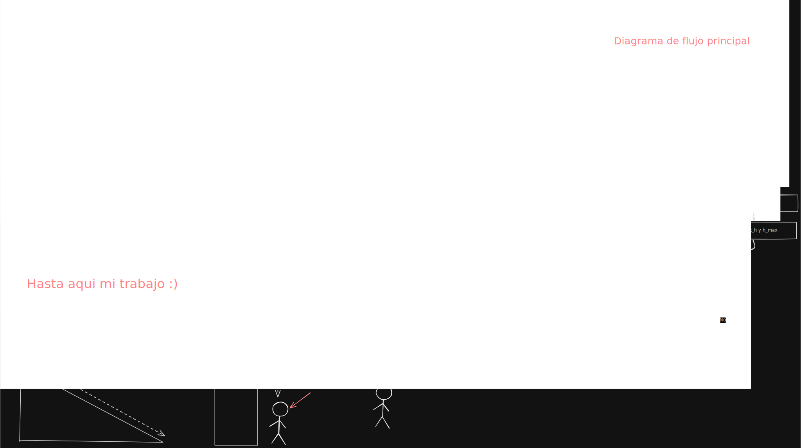

# Simulador de Movimiento

Este programa te permite simular el movimiento de un objeto de manera sencilla.

## ¿Qué hace?
Calcula la posición y velocidad de un objeto a lo largo del tiempo basándose en:
- Aceleración
- Velocidad inicial
- Posición inicial

## Cómo usarlo
1.  **Compila** el código ejecutando `make` en tu terminal.
2.  **Ejecuta** el programa resultante (`./simulador`).
3.  **Ingresa los valores** que te solicite.
4.  Revisa el archivo `datos.csv` para ver los resultados paso a paso.

## Creación

Aquí esta todos los datos que se usaron para crear el programa

Tambien esta aquí el [levantamiento de requerimientos](https://docs.google.com/document/d/1mwZzM_cwhXqVC1J_IIAwz_2TuqmisSOx2MsYEuB3P4w/edit?usp=sharing)
